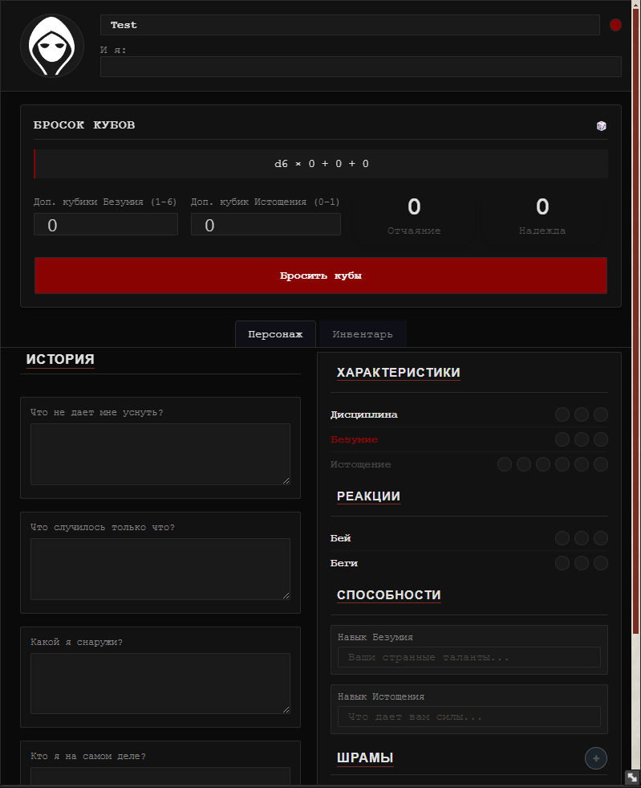
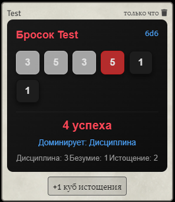
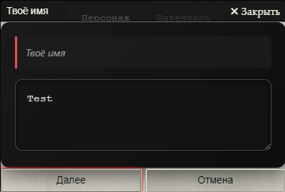

# Don't Rest Your Head - Foundry VTT System

Система для настольной ролевой игры **Don't Rest Your Head** (Evil Hat Productions) в среде Foundry Virtual Tabletop.

## Совместимость

- **Foundry VTT**: версия 11 и выше (проверено на v13)
- **Язык**: русский (интерфейс и встроенные тексты)

## Особенности

- **Полный лист персонажа**  
  - Основные характеристики: Дисциплина, Безумие, Истощение (с визуальными индикаторами-точками).  
  - Реакции: Бей и Беги (распределение до 3 очков).  
  - Навыки Безумия и Истощения (произвольный текст).  
  - Шрамы (редактируемый список).  
  - История персонажа: ответы на ключевые вопросы (Что не дает уснуть? Что случилось только что? и т.д.).
  

- **Система бросков кубов**  
  - Поддержка основных кубов (Дисциплина, Безумие, Истощение) и дополнительных кубов (выбираются перед броском).  
  - Автоматический подсчёт успехов (значения 1–3), определение доминирующего пула и учёт малого навыка Истощения (если кубов Истощения больше успехов).  
  - Визуальное отображение результатов с цветовой дифференциацией пулов.  
  - Интеграция с модулем **Dice So Nice** (3D-кубы).  
  - Возможность добавить куб Истощения или +1 к Дисциплине (за счёт Надежды) уже после броска через кнопки в сообщении.  
  

- **Глобальные ресурсы: Надежда и Отчаяние**  
  - Отслеживаются GM на отдельной панели (или через кнопку на панели сцен).  
  - Использование Надежды позволяет добавить +1 к результату Дисциплины (кнопка в сообщении броска).  
  - GM может добавлять Отчаяние или преобразовывать Отчаяние в Надежду.

- **Создание персонажа через Пробуждение**  
  - Пошаговый мастер (диалоги) для заполнения всех ключевых пунктов истории, навыков и реакций.  
  - Автоматическое обновление листа после завершения.
  

- **Инвентарь**  
  - Перетаскивание предметов из справочников.  
  - Отображение иконок и названий.  
  - Удаление предметов по клику.

## Установка

1. В Foundry VTT перейдите в настройки мира → **Игровые системы** → **Установить систему**.
2. В поле **Манифест URL** введите:
   ```
   https://raw.githubusercontent.com/amari-darey/osore/main/system.json
   ```
   (замените на актуальный адрес манифеста вашего репозитория)
3. Нажмите **Установить**.

Альтернативно: скопируйте папку системы в каталог `systems/` вашего Foundry.

## Использование

- **Лист персонажа**: откройте из журнала актёров (тип «Awake»).  
- **Бросок кубов**: на листе выберите дополнительные кубики (Безумие и/или Истощение) и нажмите «Бросить кубы». Результат появится в чате.  
- **Надежда/Отчаяние**: если вы GM, откройте панель Hope and Despair (кнопка на панели инструментов сцены) или используйте кнопки «Use Despair» и «Add Despair» (только для GM) для управления ресурсами.  
- **Добавление предметов**: перетащите предмет из любого справочника на лист персонажа (вкладка «Инвентарь»).  
- **Пробуждение**: если персонаж ещё не пробуждён, на листе отобразится индикатор (красная точка). Клик по нему запускает мастер создания.
